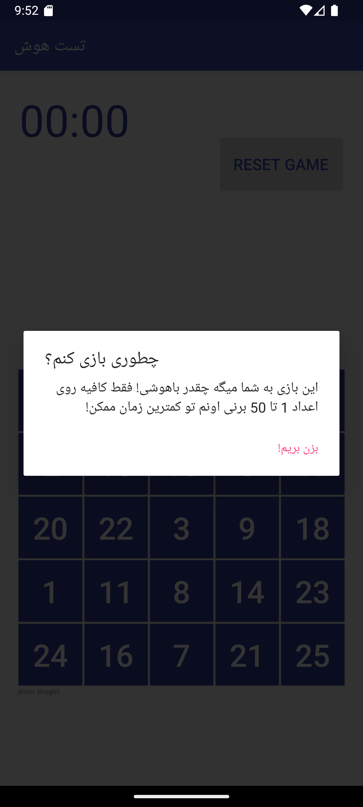
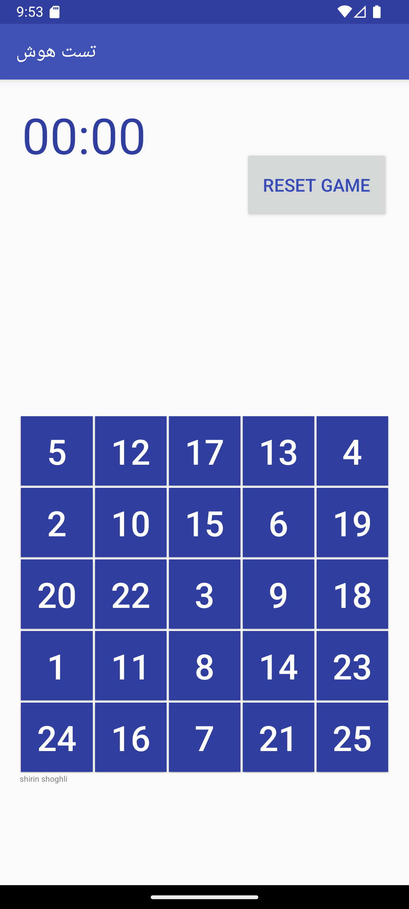
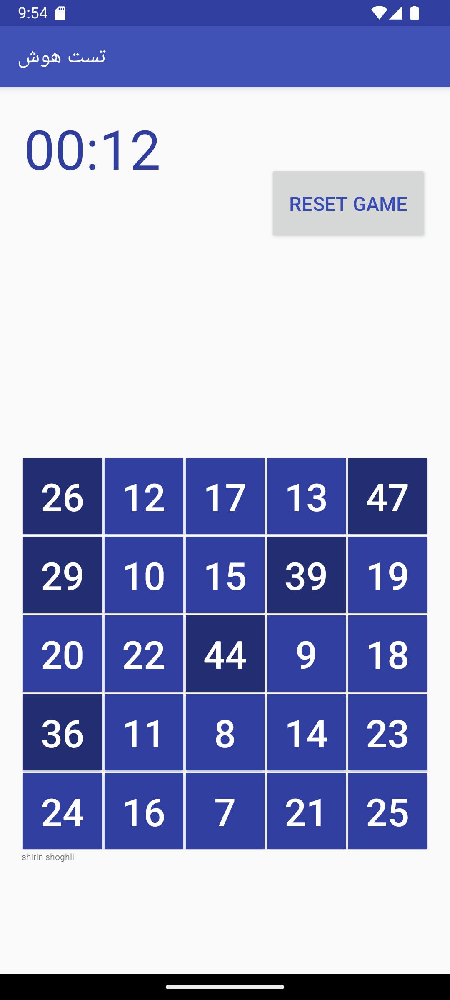
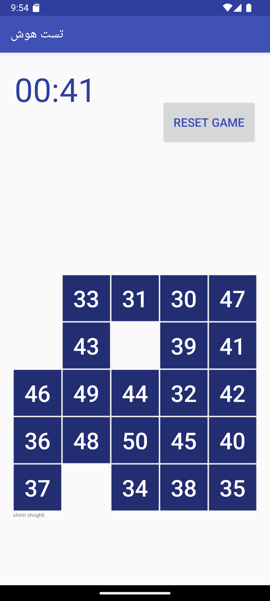
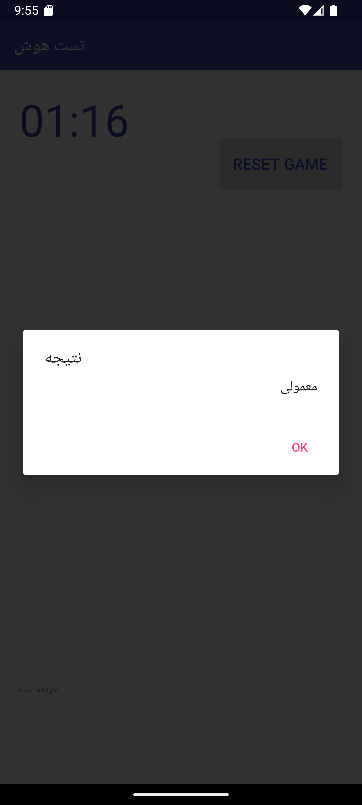

# 🎮 Simple Number Game - Android App

A fun and challenging number-based game for Android where players test their speed and memory by clicking numbers from 1 to 50 in ascending order as quickly as possible.

[](https://developer.android.com/about/versions/android-5.0)
[](https://gradle.org/)
[](https://developer.android.com/studio)

## 📱 Screenshots

| Screenshot | Description |
|------------|-------------|
|  | Instructions dialog |
|  | Main game screen with 5x5 grid |
|  | Game in progress - early stage |
|  | Game in progress - more buttons clicked |
|  | Game completion screen with the result! |

## ✨ Features

- 🎯 **5x5 Grid Gameplay**: Click numbers 1-50 in ascending order
- ⏱️ **Real-time Timer**: Track your completion speed
- 🏆 **Performance Evaluation**: Get feedback based on your time
- 🔄 **Reset Functionality**: Start over anytime
- 🌍 **Persian Interface**: Localized user experience
- 📊 **Smart Scoring**: Different performance levels based on completion time

## 🎮 How to Play

1. **Start the Game**: Launch the app and read the instructions
2. **Find Number 1**: Look for the button displaying "1" in the 5x5 grid
3. **Click in Order**: Click numbers 1, 2, 3, 4... up to 50
4. **Beat the Clock**: Complete as fast as possible
5. **Get Your Score**: See how you performed!

### 🏅 Performance Levels

| Time | Rating | Persian Text |
|------|--------|--------------|
| ≤30 seconds | 🧠 **Very Smart** | خیلی باهوشی |
| 31-60 seconds | 🎯 **Smart** | باهوشی |
| 61-90 seconds | 😊 **Average** | معمولی |
| >90 seconds | 😴 **Tired** | خسته ای :))) |

## 🛠️ Technical Requirements

- **Android Studio**: Hedgehog (2023.1.1) or later
- **Minimum Android**: API 21 (Android 5.0 Lollipop)
- **Target Android**: API 34 (Android 14)
- **Gradle**: 8.13
- **Android Gradle Plugin**: 8.12.0

## 🚀 Quick Start

### Prerequisites
- [Android Studio](https://developer.android.com/studio) installed
- Android SDK 34 installed
- An Android device or emulator

### Installation Steps

1. **Clone the repository**
   ```bash
   git clone https://github.com/shoghli1999/simple-game-java.git
   cd simple-game-java
   ```

2. **Open in Android Studio**
   - Launch Android Studio
   - Select "Open an existing Android Studio project"
   - Navigate to the cloned folder and select it

3. **Wait for Sync**
   - Let Gradle sync complete (may take a few minutes on first run)
   - Resolve any dependency issues if prompted

4. **Run the App**
   - Connect an Android device or start an emulator
   - Click the green ▶️ Run button or press `Shift + F10`

## 📁 Project Structure

```
simple-game-java/
├── app/
│   ├── src/main/
│   │   ├── java/lalopathy/shirinshoghli/
│   │   │   └── MainActivity.java          # Main game logic
│   │   ├── res/
│   │   │   ├── layout/
│   │   │   │   └── activity_main.xml      # UI layout
│   │   │   ├── values/
│   │   │   │   ├── colors.xml             # Color definitions
│   │   │   │   └── strings.xml            # String resources
│   │   │   └── drawable/
│   │   │       └── app.png                # App icon
│   │   └── AndroidManifest.xml            # App configuration
│   └── build.gradle                       # App-level build config
├── build.gradle                           # Project-level build config
├── gradle.properties                      # Gradle settings
└── README.md                              # This file
```

## 🔧 Development

### Key Components

- **MainActivity.java**: Contains all game logic including:
  - Button click handling
  - Timer management
  - Score calculation
  - UI updates

- **activity_main.xml**: Defines the 5x5 grid layout with:
  - 25 buttons arranged in a grid
  - Chronometer for timing
  - Reset button

### Recent Updates

This project has been modernized for current Android development:

- ✅ **Gradle 8.13** - Latest stable version
- ✅ **Android Gradle Plugin 8.12.0** - Latest stable version
- ✅ **AndroidX Migration** - Modern Android libraries
- ✅ **API 34 Support** - Latest Android features
- ✅ **Performance Optimizations** - Parallel builds, caching
- ✅ **Code Quality** - Fixed deprecated methods

## 🐛 Troubleshooting

### Common Issues

**Gradle Sync Fails**
```bash
# Clean and rebuild
Build → Clean Project
Build → Rebuild Project
```

**Build Errors**
```bash
# Invalidate caches
File → Invalidate Caches and Restart
```

**Device Not Detected**
- Enable Developer Options on your device
- Enable USB Debugging
- Install proper USB drivers

### Still Having Issues?

1. Check that Android Studio is up to date
2. Verify Android SDK 34 is installed
3. Try syncing project with Gradle files
4. Check the [Android Studio documentation](https://developer.android.com/studio/intro)

## 🤝 Contributing

Contributions are welcome! Please feel free to submit a Pull Request.

### How to Contribute

1. Fork the repository
2. Create a feature branch (`git checkout -b feature/AmazingFeature`)
3. Commit your changes (`git commit -m 'Add some AmazingFeature'`)
4. Push to the branch (`git push origin feature/AmazingFeature`)
5. Open a Pull Request

## 📄 License

This project is licensed under the MIT License - see the [LICENSE](LICENSE) file for details.

## 👨‍💻 Author

**Shirin Shoghli**
- GitHub: [@shoghli1999](https://github.com/shoghli1999)

## 🙏 Acknowledgments

- Android Studio team for the excellent development environment
- Google for AndroidX libraries
- The Android developer community

---

⭐ **Star this repository if you found it helpful!**

📧 **Questions?** Open an issue or contact the author.
