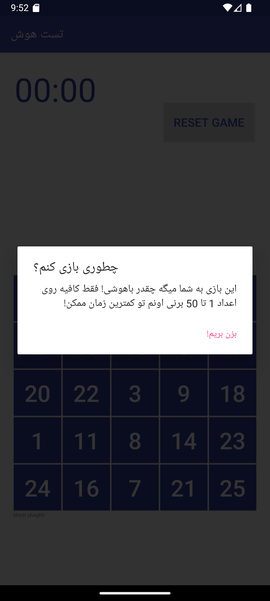
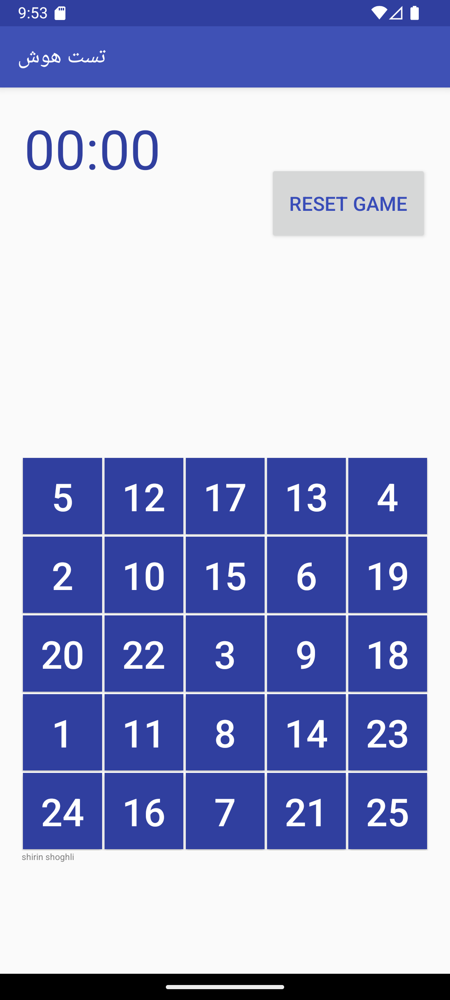
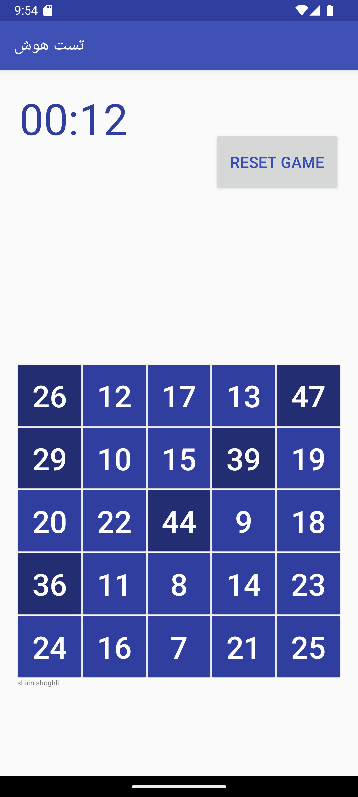
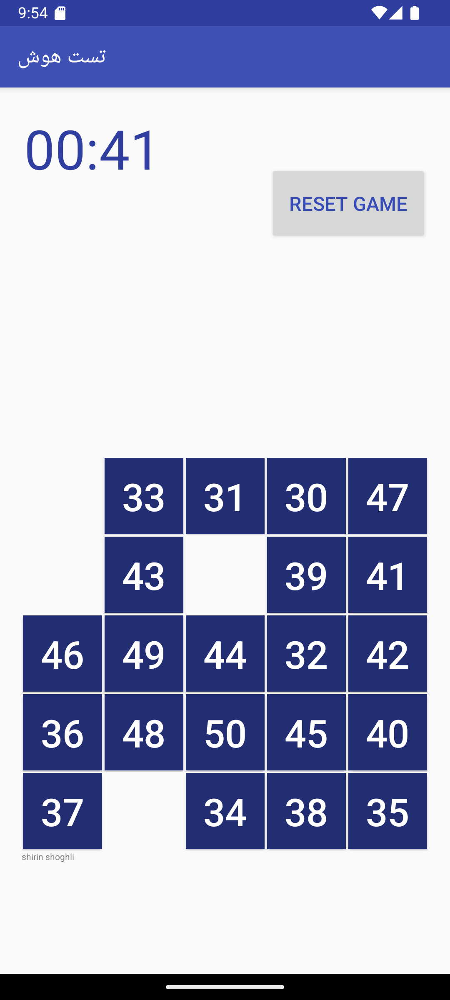
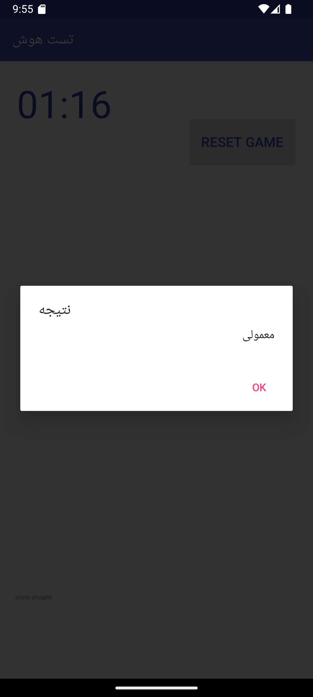

# Number game for Android

A small Android game I wrote in Java with Android Studio. You get a 5 × 5 grid of numbered buttons and have to click the numbers from 1 to 50 in order as fast as you can. A timer runs while you play, and at the end the app rates your time (in Persian):

| Time | Rating |
|---|---|
| up to 30 s | Very smart (خیلی باهوشی) |
| 31–60 s | Smart (باهوشی) |
| 61–90 s | Average (معمولی) |
| over 90 s | Tired (خسته ای) |

## Building it

Open the folder in Android Studio (Hedgehog or newer), let Gradle sync, and run it on a device or emulator with Android 5.0 (API 21) or later. The main logic is in `app/src/main/java/lalopathy/shirinshoghli/MainActivity.java`.
